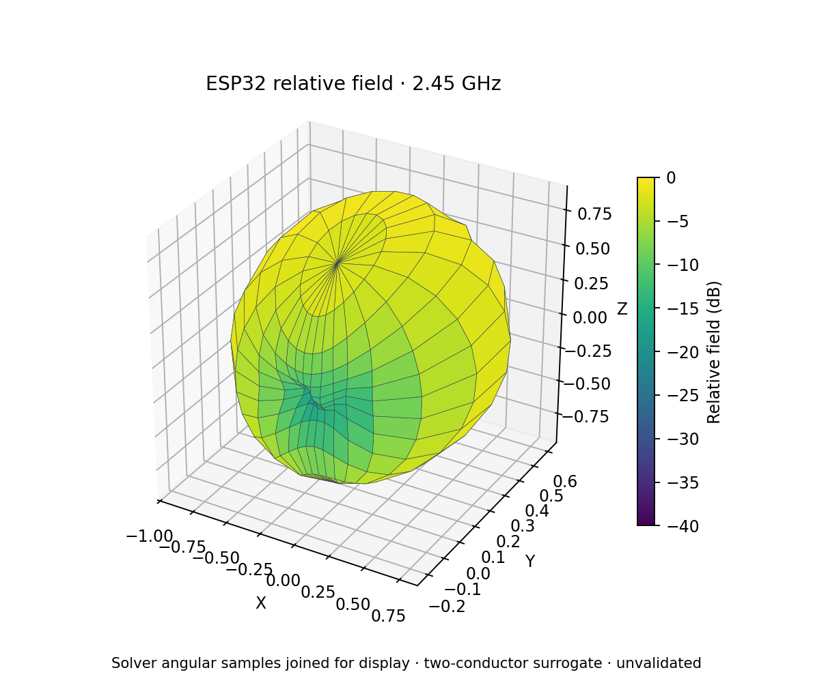

# SPIKE

SPIKE is an open-source desktop workbench for exploring a PCB's power, signal,
thermal, and electromagnetic behavior. Import a KiCad board, inspect it in 2D
or 3D, set up an analysis, and explore the results in the same workspace.

Version 0.3.0 is available as source. SPIKE runs locally and includes a
command-line interface. See the [setup guide](docs/DEVELOPER_GUIDE.md) to run
it from a checkout.

**Work in progress:** SPIKE is provided **AS IS**, without warranty or
guarantee, as set out in the [Apache License 2.0](LICENSE). Check inputs,
assumptions, and results before relying on them. Current limits are summarized
below and described in [Solver Status](docs/SOLVER_STATUS.md).

## See it in action


*An open ESP32 board in SPIKE's 3D view. This capture shows the imported board
before an analysis is run.*



*An EMerge antenna solve displayed as a relative 3D pattern. SPIKE exported a
two-conductor model of the board; the [ESP32 example](examples/esp32/README.md)
records its inputs, assumptions, and plots.*

For more examples, see the [thermal walkthrough](docs/THERMAL_USER_GUIDE.md),
[SI walkthrough](docs/SI_USER_GUIDE.md), and
[simulation studies guide](docs/SIMULATION_STUDIES.md).

## What SPIKE can do

| Area | Available workflow | Current limit |
|---|---|---|
| Board and project | Import KiCad PCB data into `DesignIR` with ordered stackup, copper, tracks, vias, pads, filled zones, components, rigid-flex regions, and import diagnostics. Inspect 2D layers and the assembled 3D scene; select nets and objects, place probes, and save versioned `.spike` projects with multiple study cases. | Some KiCad features or 3D models may be omitted or substituted; review the import report for the specific board. |
| Power integrity and circuits | Set sources, loads, returns, mesh and limits; run supported DC voltage-drop, harness, PEEC, PDN, power-tree, and circuit workflows. Converter models can include voltage, efficiency, and loss settings. | DC and PEEC paths use simplified conductor and return models. Converter behavior and pin mapping must be supplied; a footprint alone does not provide them. |
| Signal integrity | Analyze loaded RLGC or Touchstone channels with explicit ports and terminations; inspect S-parameters, reflection/VSWR, TDR/TDT, waveforms, eyes, and NEXT/FEXT. | Port-network results do not contain spatial E/H fields. Nonlinear IBIS-AMI models and protocol checks are not implemented in this workflow. |
| Thermal | Solve object-node, 2D board-plate, and layered steady/transient board models with explicit powers, heat paths and boundaries. Compare still-air, sealed-box, and forced-air presets; inspect layer maps, temperature history, case/junction estimates and board-aligned result overlays. | Cooling presets use specified heat-transfer coefficients instead of solving airflow. Board grids omit detailed package geometry and conjugate heat transfer. |
| Electromagnetics | Run EMerge on the exported antenna model and view its solved S-parameters, 2D cuts, and sampled 3D radiation pattern in SPIKE. The EM workspace also offers separate openEMS and internal screening workflows. | The SPIKE-to-EMerge adapter exports selected antenna and reference copper as a two-layer model with one dielectric; other layers and components are omitted. The 3D display interpolates and normalizes EMerge's solved angular samples, so its radius and color show relative pattern shape rather than absolute gain. |
| Visualization and reports | Orbit or inspect the board in 2D/3D, toggle geometry and result layers, probe returned values, compare studies, and preview/export reports with units, run settings, warnings, and result status. | Only quantities returned by the selected analysis can be plotted or probed. |
| Automation | Use the local worker and CLI, extension manager, solver manager, and optional MCP bridge. LM Studio and Ollama can use SPIKE tools to inspect projects, set up studies, and run supported analyses. | Local models need a separately installed runtime and tool-capable model. MCP access is limited to SPIKE's available tools. |

### Circuit simulation choices

SPIKE's circuit workspace offers a built-in linear solver and two separate
circuit-engine paths: [ngspice](docs/SOLVER_STATUS.md) and the SPIKES backend.
Select the engine that matches the circuit model and check its availability in
the app. **SPIKES Studio is a separate program and is not part of the SPIKE
desktop release.** SPIKE uses only its backend engine for supported structured
circuit runs. The [circuit workflow](docs/USER_TASK_SEQUENCES.md) explains the
model and pin setup.

SPIKE reads KiCad boards directly. The bundled ODB++ extension can also import
board jobs; keep the original archive because the saved SPIKE project stores a
normalized copy. See [Importer Architecture](docs/IMPORTER_ARCHITECTURE.md),
[task sequences](docs/USER_TASK_SEQUENCES.md), and
[Solver Status](docs/SOLVER_STATUS.md) for details.

## Bundled extensions

These are the seven packages under [`extensions/`](extensions/). Their Python
entry points run in separate processes. A bundled package supplies an adapter
or utility; optional third-party engines are installed separately. The
[Extension Manager and SDK](extension_sdk/README.md)
describe installation, permissions, and session trust for other local packages.

| Extension | Capability | Dependency and limitation |
|---|---|---|
| [OpenEMS Suite](extensions/openems_suite/README.md) | Preflight, prepare, and run explicit-port high-frequency PI and SI interconnect sweeps; import S-parameters and supported near-to-far-field outputs. | Requires separately installed openEMS/CSXCAD. Exactly one excited port per run; no DC PI or thermal coupling. Unsupported PCB topology blocks a solve. |
| [EMerge Suite](extensions/emerge_suite/README.md) | Build a selected-net two-layer PCB model for one/two-port S-parameters, 2D far-field cuts, and sampled 3D radiation patterns, including a simple dielectric cover. The pattern samples come from EMerge's field solve. | Requires a compatible separate EMerge Python runtime. The SPIKE adapter limits the model to selected copper, aligned pad ports, rectangular bounds, one dielectric and surface PEC; additional copper layers, components, many cutouts and complex surroundings are omitted. The display normalizes the pattern to a relative peak. |
| [ODB++ Import](docs/ODB_AND_HARNESS_EXTENSIONS.md) | Import a job archive/folder, choose a board step, inspect import quality, and open the normalized board in SPIKE. | Experimental; unsupported symbols, compositing, and panel step repeats are reported. Keep the original ODB++ export because a `.spike` snapshot is not the source archive. |
| [Harness Engineering](docs/ODB_AND_HARNESS_EXTENSIONS.md) | Import JSON/CSV/TSV connections, edit wire nets and lengths, validate connectivity, compile an electrical fragment, bind an assembly, and export JSON. | Reads the listed connection-list formats; it does not import other harness database formats. |
| [MCAD Collaboration](docs/MCAD_EXPORT.md) | Preview a mechanical assembly and export named STEP, FreeCAD, BREP, and metadata artifacts. | Requires installed FreeCAD. Geometry exchange only; inspect listed omissions before export. |
| [PWM Converter Analysis](extensions/converter-analysis/spike-extension.json) | Check converter-study readiness and create a versioned setup envelope. | Assistant and validator only: the extension does not contribute a converter solver run or calculate efficiency and losses. |
| [Net Inventory](extensions/net-inventory/spike-extension.json) | Example SDK utility that counts normalized nets and conductors and emits report data. | Inventory only; it performs no numerical analysis. |

The [extension analysis contract](docs/EXTENSION_ANALYSIS_API.md) binds external
results to the current design and checks their format, source, units, and bounds;
these checks do not repeat an external engine's calculation. The SDK's
[field-data and mesh-field examples](extension_sdk/README.md) demonstrate
handoff and display, not supported solver integrations.

## Try the CLI

```powershell
.\spike.cmd --help
.\spike.cmd --output-format text inspect board.kicad_pcb
.\spike.cmd --output result.json analyze-dc board.kicad_pcb `
  --net VCC `
  --source 10,10,F.Cu,5 `
  --load 50,20,F.Cu,1
```

The CLI can also run saved requests and batches, inspect available solvers, and
generate reports. See the [CLI reference](docs/CLI.md).

## More information

- [Guides and tutorials](docs/README.md), including [thermal](docs/THERMAL_USER_GUIDE.md), [signal integrity](docs/SI_USER_GUIDE.md), and the [ESP32 example](examples/esp32/README.md)
- [Solver status and numerical limits](docs/SOLVER_STATUS.md)
- [Local LLM and MCP setup](docs/LOCAL_LLM_MCP.md) for LM Studio or Ollama
- [Contributing](CONTRIBUTING.md), [developer setup](docs/DEVELOPER_GUIDE.md), and [architecture](ARCHITECTURE.md)
- [Report a bug](https://github.com/wayri/SPIKE-Main/issues/new?template=bug_report.yml) with a small reproducible example; review your report before sharing board data

## License

SPIKE-owned code and documentation are licensed under [Apache 2.0](LICENSE).
Dependencies, external engines, and example boards retain their own licenses;
see [third-party notices](THIRD_PARTY_NOTICES.md).

## Acknowledgements

- The KiCad project and its contributors for the PCB ecosystem SPIKE works with.
- The Tauri, React, Three.js, Plotly.js, and Lucide projects behind the desktop interface and plots.
- The NumPy, SciPy, Shapely/GEOS, PyVista, wxPython, nanobind, Matplotlib, mplcursors, ReportLab, Apache Arrow, jsonschema, and Eigen projects used by the Python and native tooling.
- The ngspice, openEMS, OpenFOAM, and FreeCAD communities, and Robert Fennis for EMerge, which SPIKE can connect to when separately installed.
- Berkeley Lab and the Regents of the University of California for the Marble reference board, and uysan for the open `iot-esp-eth` ESP32 board used in the worked example.
- Contributors, testers, issue reporters, and documentation authors who help improve SPIKE.

If we have missed a credit, please open an issue or pull request. License and
source details for included examples and integrations are in the
[third-party notices](THIRD_PARTY_NOTICES.md).
