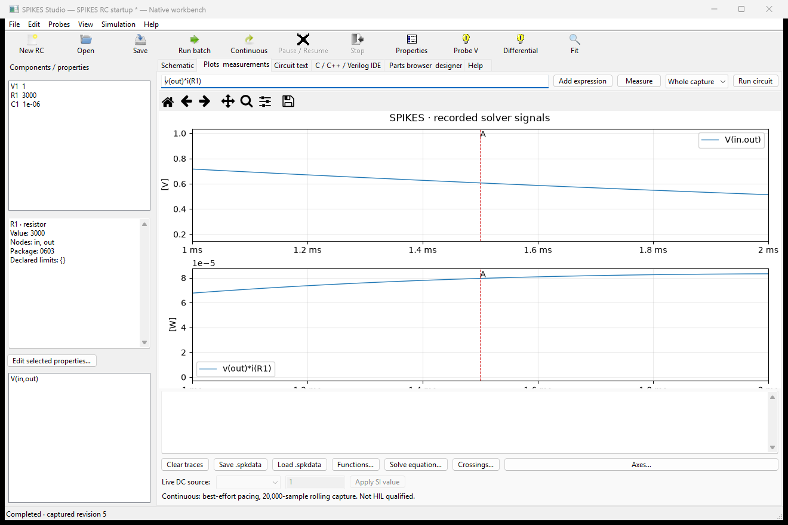
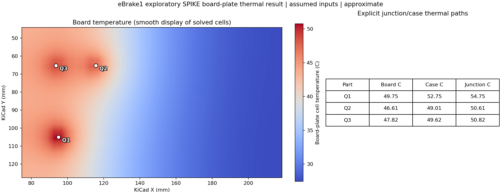
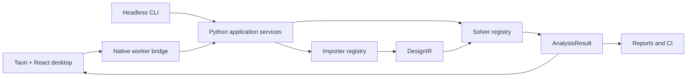

# SPIKE: Signal, Power, and Integrity Knowledge Engine


**Desktop/CLI version:** 0.3.0 (engineering preview)

The separately versioned SPIKES circuit engine has a `0.3.0-beta.1` release
candidate. See [public release readiness](docs/PUBLIC_RELEASE_READINESS.md) for
its distribution status.

SPIKE is an offline-first desktop app for exploring PCB power, signal, thermal,
and electromagnetic behavior. Import a board, inspect it in 2D or 3D, set up
analyses, and review plots and reports. A local Python worker runs the available
solvers; the same project and results can be used from the command line.

**Work in progress:** SPIKE is provided **AS IS**, without warranty or
guarantee, as set out in the [Apache License 2.0](LICENSE). Check inputs,
assumptions, and results before relying on them. The specific model boundaries
are summarized below and recorded in [Solver Status](docs/SOLVER_STATUS.md).

**0.3.0 Windows package disclosure:** The current community-preview MSI is
unsigned and requests all-user privileges. Its contents and checksum are in
the [0.3.0 verification](docs/RELEASE_0_3_0_VERIFICATION.md). Clean-machine
installation, upgrade, and uninstall checks are not yet complete.

The [illustrated thermal user guide](docs/THERMAL_USER_GUIDE.md) walks through
board import, heat-path setup, local solves, layer maps, and analysis using a
pinned open-source Marble board and a bundled layered development fixture.
Its [transient example](docs/validation/EBRAKE1_LAYERED_TRANSIENT_20260928.md)
includes a saved board-temperature animation and numerical checks. The
[SI user guide](docs/SI_USER_GUIDE.md) covers the executable S-parameter,
reflection/VSWR, NEXT/FEXT, TDR/TDT, and eye workflow with Marble board
context and a separate analytical four-port channel.

Local LM Studio and Ollama models can operate an allowlisted SPIKE MCP tool set.
The desktop bridge is enabled from **Settings → LLM / MCP**; see the
[offline LLM and MCP guide](docs/LOCAL_LLM_MCP.md) for setup and limits.

The [ESP32 worked example](examples/esp32/README.md) records board import,
PI/SI/thermal runs, antenna plots, viewport captures, inputs, and result
limitations. The [simulation studies guide](docs/SIMULATION_STUDIES.md)
explains how to keep multiple analysis cases and conditions in one project.

## Screenshots

### Circuit simulation and trace inspection



SPIKES Studio shows recorded signals from an illustrative RC circuit simulation.
This is a circuit-workflow example, not a PCB field result. SPIKES is
separately versioned from the SPIKE desktop.

### Simulated board temperature (illustrative inputs)



This solved eBrake1 temperature grid uses assumed material, cooling, and
component-power inputs. It is labeled `approximate` and has not been correlated
to a measured board. The [reproducible input, units, numerical checks, and
limits](docs/validation/EBRAKE1_BOARD_THERMAL_20260928.md) accompany the image.

### KiCad board import and project report


These SPIKE 0.2.12 development captures show the public Marble v1.4.4 board
after import. The components are procedural and the report explicitly says
**ANALYSIS NOT RUN**. They do not show a native-worker result. Board revision,
hash, import limits, and image provenance are recorded in the
[Marble qualification plan](docs/MARBLE_CLI_QUALIFICATION_PLAN.md) and
[third-party notices](THIRD_PARTY_NOTICES.md).

## What SPIKE can do

| Area | Available workflow | Current limit |
|---|---|---|
| Board and project | Import KiCad PCB data into `DesignIR` with ordered stackup, copper, tracks, vias, pads, filled zones, components, rigid-flex regions, and import diagnostics. Inspect 2D layers and the assembled 3D scene; select nets and objects, place probes, and save versioned `.spike` projects with multiple study cases. | Some KiCad features or 3D models may be omitted or substituted; review the import report for the specific board. |
| Power integrity and circuits | Set sources, loads, returns, mesh and limits; run capability-gated DC voltage-drop, harness, PEEC, PDN, power-tree, and staged circuit workflows. Explicit converter models can carry voltage and efficiency or loss assumptions. | DC and PEEC paths use simplified conductor and return models. Converter behavior and pin mapping must be supplied; a footprint alone does not provide them. |
| Signal integrity | Analyze loaded RLGC or Touchstone channels with explicit ports and terminations; inspect S-parameters, reflection/VSWR, TDR/TDT, waveforms, eyes, and NEXT/FEXT. | Port-network results do not contain spatial E/H fields. Nonlinear IBIS-AMI models and protocol checks are not implemented in this workflow. |
| Thermal | Solve object-node, 2D board-plate, and layered steady/transient board models with explicit powers, heat paths and boundaries. Compare still-air, sealed-box, and forced-air presets; inspect layer maps, temperature history, case/junction estimates and board-aligned result overlays. | Cooling presets use specified heat-transfer coefficients instead of solving airflow. Board grids omit detailed package geometry and conjugate heat transfer. |
| Electromagnetics | Run EMerge on the exported antenna model and view its solved S-parameters, 2D cuts, and sampled 3D radiation pattern in SPIKE. The EM workspace also offers separate openEMS and internal screening workflows. | The SPIKE-to-EMerge adapter exports selected antenna and reference copper as a two-layer model with one dielectric; other layers and components are omitted. The 3D display interpolates and normalizes EMerge's solved angular samples, so its radius and color show relative pattern shape rather than absolute gain. |
| Visualization and reports | Orbit or inspect the board in 2D/3D, toggle geometry and result layers, probe returned values, compare studies, and preview/export reports with units, provenance, warnings, and validity state. | Only quantities returned by the selected analysis can be plotted or probed. |
| Automation | Use the local worker/CLI, extension manager, solver manager, and opt-in MCP bridge. LM Studio and Ollama can call an allowlisted local tool set for inspection, setup, studies, and admitted analyses. | Local models need a separately installed runtime and tool-capable model. MCP access does not grant arbitrary file writes, shell commands, extension trust, or unsupported solves. |

SPIKE reads KiCad boards directly. The bundled ODB++ extension can also import
board jobs; keep the original archive because the saved SPIKE project stores a
normalized copy. See [Importer Architecture](docs/IMPORTER_ARCHITECTURE.md),
[task sequences](docs/USER_TASK_SEQUENCES.md), and
[Solver Status](docs/SOLVER_STATUS.md) for details.

## Bundled extensions

These are the seven packages under [`extensions/`](extensions/). Their Python
entry points run in separate processes. A bundled package supplies an adapter
or utility; optional third-party engines are installed separately. The
[Extension Manager and SDK](extension_sdk/README.md)
describe installation, permissions, and session trust for other local packages.

| Extension | Capability | Dependency and limitation |
|---|---|---|
| [OpenEMS Suite](extensions/openems_suite/README.md) | Preflight, prepare, and run explicit-port high-frequency PI and SI interconnect sweeps; import S-parameters and supported near-to-far-field outputs. | Requires separately installed openEMS/CSXCAD. Exactly one excited port per run; no DC PI or thermal coupling. Unsupported PCB topology blocks a solve. |
| [EMerge Suite](extensions/emerge_suite/README.md) | Build a selected-net two-layer PCB model for one/two-port S-parameters, 2D far-field cuts, and sampled 3D radiation patterns, including bounded dielectric-cover examples. The pattern samples come from EMerge's field solve. | Requires a compatible separate EMerge Python runtime. The SPIKE adapter limits the model to selected copper, aligned pad ports, rectangular bounds, one dielectric and surface PEC; additional copper layers, components, many cutouts and complex surroundings are omitted. The display normalizes the pattern to a relative peak. |
| [ODB++ Import](docs/ODB_AND_HARNESS_EXTENSIONS.md) | Import a job archive/folder, choose a board step, inspect import quality, and open the normalized board in SPIKE. | Experimental; unsupported symbols, compositing, and panel step repeats are reported. Keep the original ODB++ export because a `.spike` snapshot is not the source archive. |
| [Harness Engineering](docs/ODB_AND_HARNESS_EXTENSIONS.md) | Import JSON/CSV/TSV connections, edit wire nets and lengths, validate connectivity, compile an electrical fragment, bind an assembly, and export JSON. | Reads the listed connection-list formats; it does not import other harness database formats. |
| [MCAD Collaboration](docs/MCAD_EXPORT.md) | Preview a mechanical assembly and export named STEP, FreeCAD, BREP, and metadata artifacts. | Requires installed FreeCAD. Geometry exchange only; inspect listed omissions before export. |
| [PWM Converter Analysis](extensions/converter-analysis/spike-extension.json) | Check converter-study readiness and create a versioned setup envelope. | Assistant and validator only: the extension does not contribute a converter solver run or calculate efficiency and losses. |
| [Net Inventory](extensions/net-inventory/spike-extension.json) | Example SDK utility that counts normalized nets and conductors and emits report data. | Inventory only; it performs no numerical analysis. |

The [extension analysis contract](docs/EXTENSION_ANALYSIS_API.md) binds external
results to the current design and checks schema, provenance, units, and bounds;
these checks do not repeat an external engine's calculation. The SDK's
[field-data and mesh-field examples](extension_sdk/README.md) demonstrate
handoff and display, not supported solver integrations.

## Reference board

Documentation and current visual-import checks use the public Berkeley Lab
Marble v1.4.4 dual-FMC FPGA carrier as the consistent reference board. The
workspace image above is a SPIKE 0.2.12 local browser capture after source import, with
procedural component models and no native desktop worker. It is not a solver
result. The pinned revision, source hash,
import counts, limits, and license provenance are recorded in
[the Marble qualification plan](docs/MARBLE_CLI_QUALIFICATION_PLAN.md) and
[third-party notices](THIRD_PARTY_NOTICES.md). The bundled E-brake and
removed-board files remain parser/regression fixtures and are not the
documentation reference design.

## Architecture



Read [ARCHITECTURE.md](ARCHITECTURE.md) before making cross-cutting changes.
The repository intentionally supports conventional human development without
an AI runtime or prompt history.

## Repository layout

| Path | Purpose |
|---|---|
| `app/src` | React UI, workflows, 2D/3D rendering, reports |
| `app/src-tauri` | Native desktop window, dialogs, process isolation |
| `python/spike_core` | Contracts, importers, CLI/services, solver plugins |
| `python/core` | Current low-level KiCad parser |
| `src` | C++ numerical kernels and bindings |
| `solver_sdk` | Solver plugin interface |
| `extension_sdk` | General extension interface |
| `kicad_plugin` | Legacy/source-specific KiCad import and launch adapter scaffold; never a solver boundary |
| `tests/python` | Contract, importer, workflow, and numerical tests |
| `docs` | User, developer, validation, security, and architecture records |

See [Subsystem Index](docs/SUBSYSTEM_INDEX.md) for file-level ownership.

## Headless CLI

```powershell
.\spike.cmd --help
.\spike.cmd --output-format text inspect board.kicad_pcb
.\spike.cmd --output result.json analyze-dc board.kicad_pcb `
  --net VCC `
  --source 10,10,F.Cu,5 `
  --load 50,20,F.Cu,1
```

The CLI supports design import and validation, solver discovery, geometry
extraction, saved requests, project execution, batches, reports, and regression
gates. See [CLI Reference](docs/CLI.md).

## Development

Core checks on Windows:

```powershell
python -m unittest discover -s tests\python -v
cd app
npm.cmd ci
npm.cmd run check:architecture
npm.cmd exec tsc -- --noEmit
npm.cmd run test:parser
npm.cmd run build
cd src-tauri
cargo test
```

Use `npm` only for the locked frontend build graph. It is not a runtime network
dependency: packaged SPIKE runs offline with compiled frontend assets. Release
security depends on lockfile review, dependency scanning, a restrictive Tauri
capability/CSP policy, and bundled dependency verification. See
[Security Model](docs/SECURITY_MODEL.md).

For setup and extension instructions, read [Developer Guide](docs/DEVELOPER_GUIDE.md)
and [Contributing](CONTRIBUTING.md). Linux requirements are in
[Linux Support](docs/LINUX.md).

## Accuracy and validation

Numerical changes require analytical or measured fixtures, tolerances,
convergence/conditioning evidence, and documented validity limits. SPIKE
distinguishes `validated`, `approximate`, `unsupported`, and
`failed_to_converge`. Public validation artifacts live in `docs/validation`.

See [Validation Program](docs/VALIDATION_PROGRAM.md),
[Engineering Governance](docs/ENGINEERING_GOVERNANCE.md), and
[Test Fixtures](docs/TEST_FIXTURES.md).

## Community feedback

Use the [structured bug report](https://github.com/wayri/SPIKE-Main/issues/new?template=bug_report.yml)
for reproducible failures, unexpected numerical results, or confusing validity
labels. The desktop **Help → Report bug** command opens this form with only the
SPIKE version, release channel, platform family, runtime type, and current
workspace prefilled. Review the draft before submitting it. SPIKE does not
automatically send a board, project, net name, file path, log, or solver result.
Include a minimal synthetic or anonymized reproduction, exact steps, expected
and actual behavior, units, mesh/settings, validity state, and relevant
warnings. Do not publish private designs, credentials, license files, or
customer information. Community reports help prioritize fixes; they do not
replace the project's numerical validation and release reviews.
The [open-source release plan](docs/OPEN_SOURCE_RELEASE_PLAN.md) records the
publication sequence and suggested community venues.

## Acknowledgements

SPIKE builds on the KiCad ecosystem and the Tauri, React, NumPy, SciPy, and
Shapely projects. The Berkeley Lab Marble board provides a documented public
reference for import and visual examples under its own terms. Optional external
engines remain separate products with their own licenses and validation scope.
The optional EMerge adapter targets Robert Fennis's EMerge project; EMerge is
not bundled with SPIKE. The integration's source and API references are recorded in
the [EMerge extension guide](extensions/emerge_suite/README.md).
See [third-party notices](THIRD_PARTY_NOTICES.md) and the
[Marble source record](docs/CERN_MARBLE_EVALUATION_20260920.md) for provenance.

## Stability

Heavy worker calls run outside the UI thread with operation IDs, size caps,
single-job admission, concurrent output draining, and watchdog termination.
Malformed parser input fails explicitly, and the UI has a root recovery
boundary. Cooperative cancellation and broader process-failure tests remain
planned. See [Stability and Recovery](docs/STABILITY_AND_RECOVERY.md).

## License

Original SPIKE-owned code, documentation, and media are under the standard
[Apache License 2.0](LICENSE), which permits a future commercial build or hosted
service. Other recipients receive the same commercial rights. External
libraries, engines, models, and board assets retain their own licenses.
The separately versioned SPIKES circuit engine, the `spike-solvers`
repository, and the FreeCAD workbench retain their existing terms.
Review [the license boundary and release obligations](LICENSING.md) and
[third-party notices](THIRD_PARTY_NOTICES.md) before distributing a build.
The current 0.3.0 GitHub publication is a source-only community preview.
