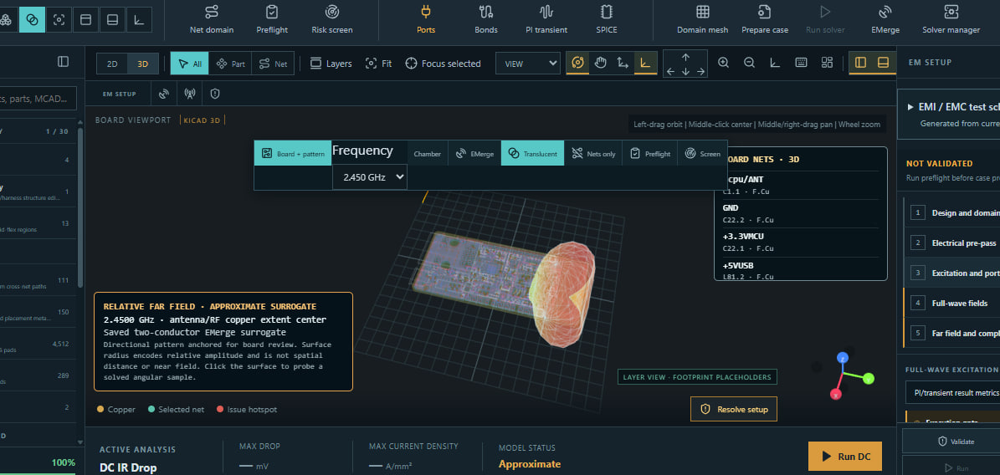

# Your first five minutes with SPIKE

Import an ESP32 board, open saved thermal and antenna results, and inspect
them in SPIKE's board viewport. Allow about five minutes after downloading
and installing. This walkthrough displays existing results; no external solver
installation or new solve is needed.

## Download and prepare

1. Download `SPIKE_0.3.0_x64-setup.exe` from the
   [0.3.0 release](https://github.com/wayri/SPIKE-Main/releases/tag/v0.3.0)
   and install SPIKE. The community preview installer is unsigned.
2. Download **Source code (zip)** from the same release and extract it.
   The example files are in `examples/esp32/` inside the extracted folder.
3. Keep that folder open. You will use these three files:

| Purpose | File under `examples/esp32/` |
| --- | --- |
| Board | `source/iot-esp-eth-ind.kicad_pcb` |
| Saved thermal view | `evidence/thermal_view_bundle.json` |
| Saved EMerge radiation result | `evidence/rf_surrogate_rerun_result.json` |

## 1. Import the board — about one minute

Launch SPIKE and use **Import** in the project toolbar to select the board
file above. Let the import finish, then use **Fit** to frame the board.
Switch between **2D** and **3D** and zoom toward the antenna end. You should
see the board outline, copper, pads, and component geometry. Missing component
models may appear as placeholders.

## 2. Open and probe temperature — about two minutes

1. Choose **Thermal**, then **3D**.
2. Use **Open saved** (or **Open saved thermal** when no result is loaded)
   and select `thermal_view_bundle.json`.
3. Turn on **Field**. Colored temperature cells should appear over the board.
4. Click a cell to inspect its temperature, layer, physical depth, and X/Y
   location. Click the same position again to cycle through visible layers.
5. Orbit the board to inspect the overlay from another side. Use **Plots**
   to inspect the temperature grid and available X/Y/Z cuts.

The example assumes 1.35 W total component dissipation. Its temperatures are
model outputs, not measured ESP32 temperatures. Layer spacing in the display
is expanded for inspection; the probe reports the physical depth.

## 3. Open and probe the antenna pattern — about two minutes

1. Choose **EM → EMerge → Open saved radiation result**.
2. Select `rf_surrogate_rerun_result.json`.
3. Choose **Board + pattern** if the board is not visible, then select
   **2.450 GHz** in the frequency control.
4. Orbit the board and click the radiation surface to inspect an angular
   sample in relative dB. Explore the 2D cut and S-parameter plots in the
   results view. **Chamber** opens the separate pattern view.

This saved EMerge solve uses a simplified two-conductor antenna model.
The surface shows relative pattern shape; its size is not a physical distance
and its values are not absolute antenna gain.

## If something does not appear

- Import the exact supplied board before opening either saved result. The
  thermal bundle is bound to that board; an edited copy may not match.
- For temperature, enable **Field** and use **Fit**. For radiation, choose
  **Board + pattern** and a saved frequency.
- Loading a saved result does not require pressing **Run**. New solves need
  the relevant worker or external engine and a complete setup.

Continue with the [full ESP32 example](../examples/esp32/README.md) for inputs,
solver settings, and rerun instructions, or the [short demo guide](ESP32_DEMO_GUIDE.md)
to present these views to someone else.
