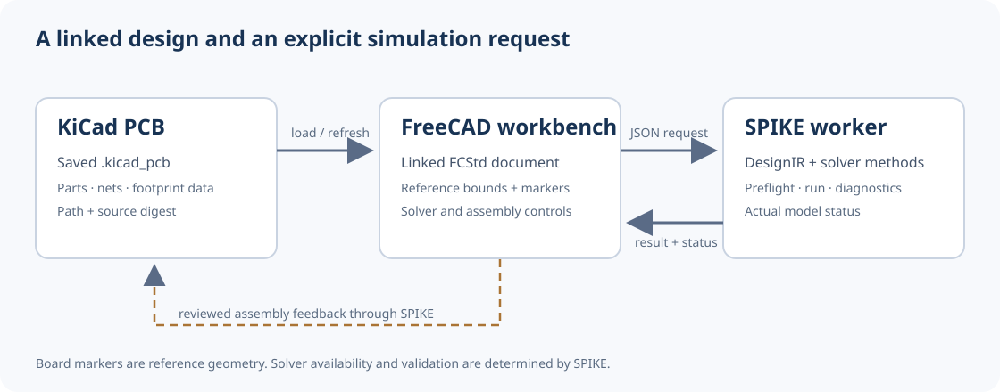
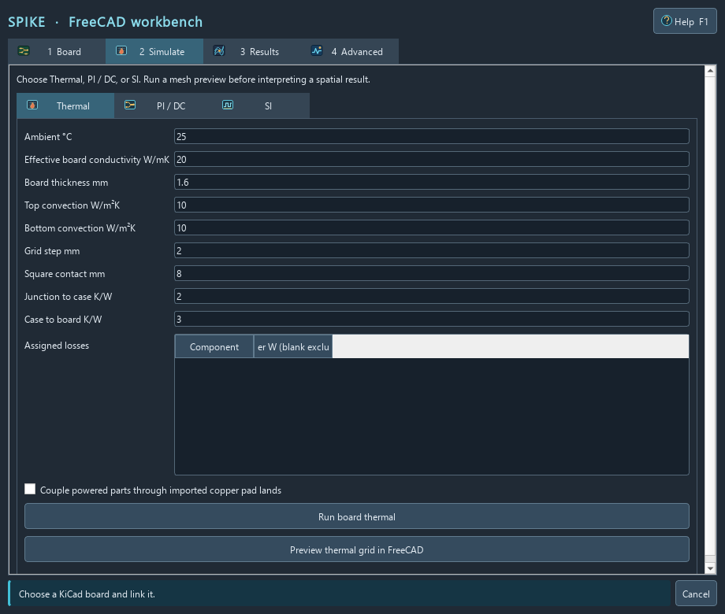
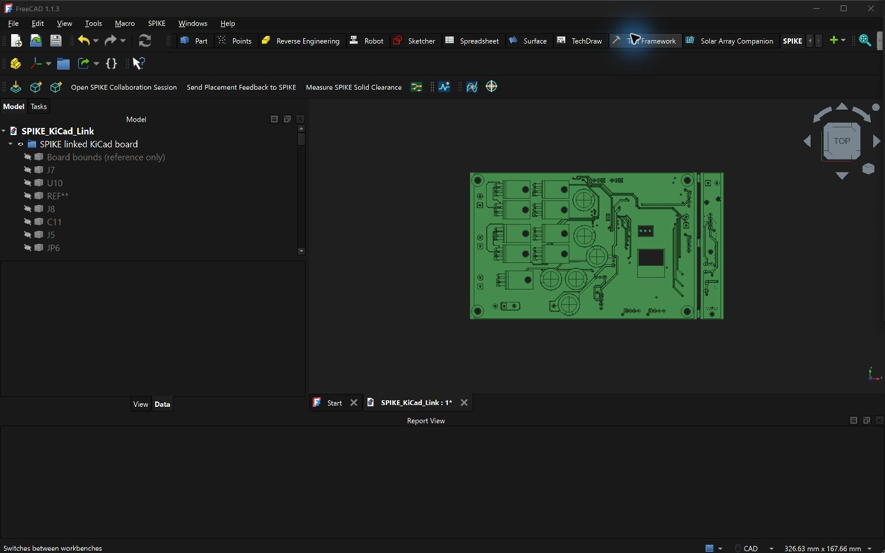
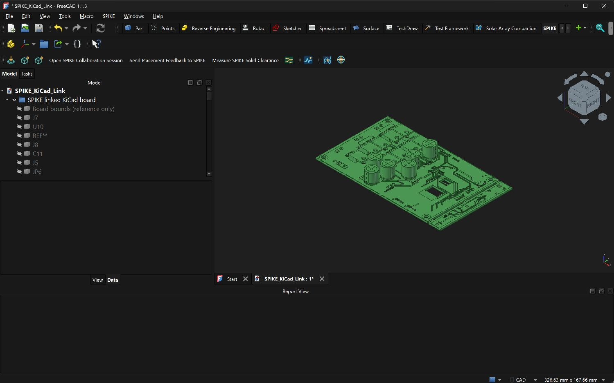
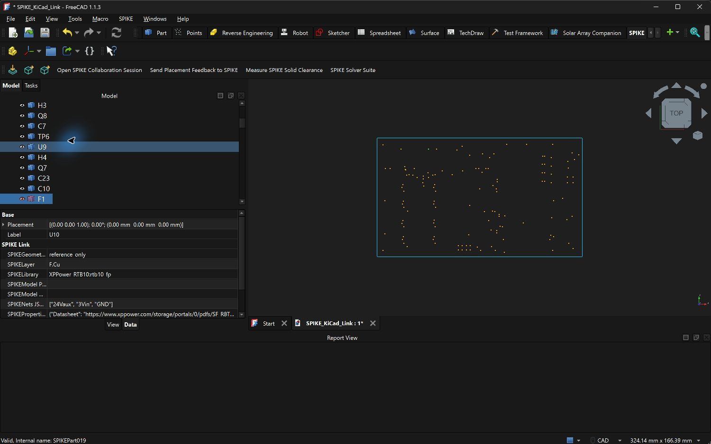
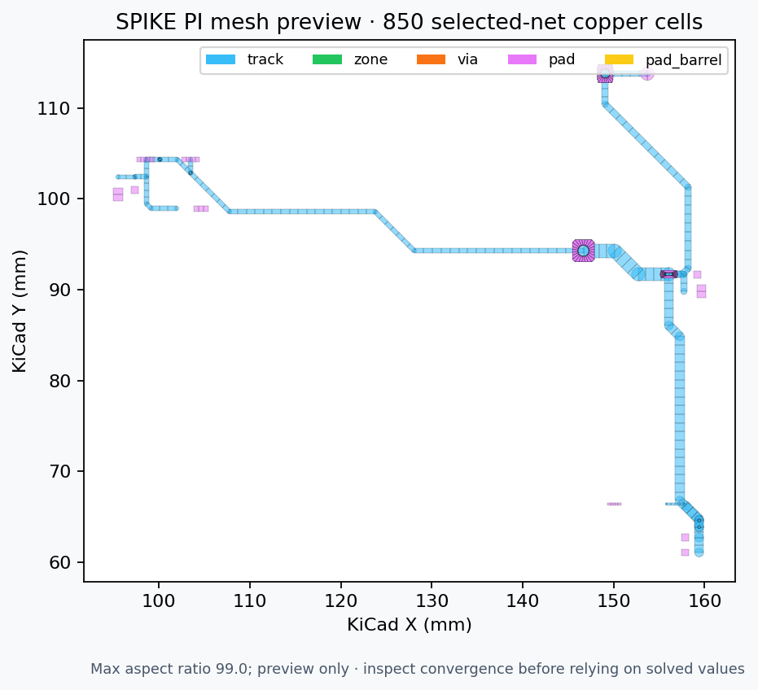
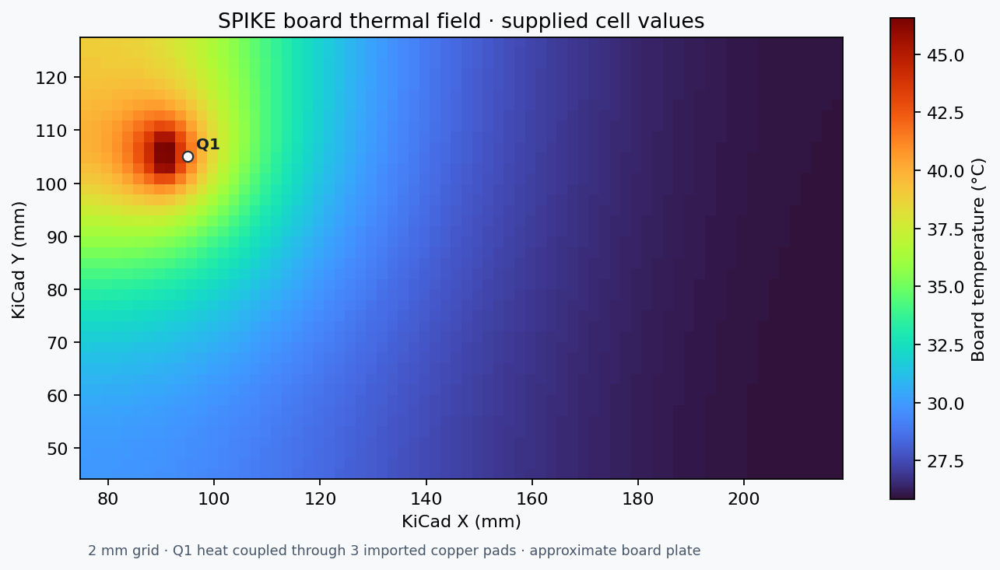

# SPIKE FreeCAD Workbench

The SPIKE workbench links a FreeCAD document to a KiCad board and runs simulations through a separately installed SPIKE worker. It also exchanges bounded ECAD/MCAD geometry and supports reviewed assembly placement feedback. The workbench is a client; solver availability, validation, and result status come from SPIKE.

Start with the task-oriented [user guide](docs/USER_GUIDE.md) for installation,
board refresh, visibility controls, simulation forms, result viewing, and
recovery steps. This README remains the detailed capability and packaging
reference.



**Version:** 0.5.0 · **License:** MIT · **FreeCAD:** 0.21 or newer. The KiCad link and solver panel were exercised on FreeCAD 1.1.3 for Windows.

## Capabilities and limits

| Area | Available now | Limit |
| --- | --- | --- |
| KiCad PCB link | Board, copper, pads, tracks, zones, holes and available component models imported via KiCad STEP; part metadata and source digest retained in FCStd | KiCad STEP is visualization geometry, not a lossless copper simulation mesh; missing library models remain missing |
| SPIKE simulations | Native Thermal, PI/DC and SI setup tabs; worker catalog, preflight, advanced method and JSON params, configured suite, asynchronous run, cancel and response export | Each method has its own input contract and runtime; a visible command does not imply a validated model |
| Results | Toggle substrate, copper, component models, references and result overlay separately; plot supplied SI/circuit traces and probe spatial samples | Spatial overlays require actual solver samples; SI port networks do not supply 3D E/H fields |
| Collaboration | Open SPIKE sessions, edit occurrence placements and labels, measure solid clearance, send reviewable feedback | FreeCAD edits do not silently rewrite KiCad; new geometry uses assembly export |
| Geometry exchange | Import validated primitives; export bounding-box envelopes, keepouts, and STEP-backed assemblies | Primitive exchange is not physical simulation or manufacturing qualification |

The worker can report `approximate`, `unsupported`, or blocked preflight. Retain its actual status and assumptions when reporting results. See `docs/SOLVER_STATUS.md` in the separate SPIKE worker checkout.



*FreeCAD 1.1 Qt render of the Thermal controls. The panel also includes Board, Results, Advanced, and searchable F1 help pages.*

## Requirements

1. FreeCAD 0.21 or later with Part available.
2. A local SPIKE source checkout containing `python/spike_core/service.py` for KiCad linking and solver calls.
3. A separate Python executable with the SPIKE runtime dependencies. Use the checkout's working virtual environment when available. FreeCAD's bundled Python does not need those dependencies.
4. A saved `.kicad_pcb` for the linked workflow. KiCad need not remain open. KiCad CLI 10 is required for the detailed board and copper STEP import.

Some methods require external solver engines and their own installation or license. Inspect **Catalog**, preflight, and SPIKE's solver status before relying on them. Geometry exchange and collaboration sessions can be used without a worker runtime.

Set up the worker environment from the SPIKE checkout using its `DEVELOPMENT.md` and pinned dependency guidance. On Windows, a source development environment can start with:

```powershell
cd 'C:\path\to\SPIKE'
py -3.12 -m venv .venv
.\.venv\Scripts\python.exe -m pip install -r requirements.txt
'{"id":"health","method":"health","params":{}}' |
  .\.venv\Scripts\python.exe -m python.spike_core.service
```

Use a Python version and dependency set supported by that SPIKE checkout; the commands above do not install optional external engines. A successful health response has `ok: true`. On Linux/macOS, use `python3 -m venv .venv`, `./.venv/bin/python`, and the platform guidance in SPIKE's `DEVELOPMENT.md`. If an existing SPIKE environment already passes health, reuse it instead of reinstalling.

## Install, update, or remove

Close FreeCAD. Copy the **entire** `SPIKEWorkbench` directory into the user `Mod` directory. It must contain `Init.py`, `InitGui.py`, `package.xml`, `Resources`, `spike_freecad`, `docs`, and `LICENSE` directly beneath `SPIKEWorkbench`. Replace that folder to update, then restart FreeCAD and choose **SPIKE** in the workbench selector.

| Platform | Typical installation path |
| --- | --- |
| Windows | `%APPDATA%\FreeCAD\Mod\SPIKEWorkbench` or a versioned `%APPDATA%\FreeCAD\v1-1\Mod\SPIKEWorkbench` |
| Linux | `~/.local/share/FreeCAD/Mod/SPIKEWorkbench` |
| macOS | `~/Library/Application Support/FreeCAD/Mod/SPIKEWorkbench` |

In FreeCAD's Python console, `App.getUserAppDataDir()` gives the authoritative user path; append `Mod/SPIKEWorkbench`. To remove the workbench, close FreeCAD and remove only that installed directory. From the workbench source root, `python tools/package.py --kind install --output <new-zip-path>` builds an installable ZIP without the parent SPIKE checkout. Extract it into `Mod` so its top-level directory is `SPIKEWorkbench`.

## First run: link a KiCad board

1. Choose **SPIKE > SPIKE Solver Suite**.
2. Set **SPIKE source** to the checkout containing `python/spike_core/service.py`.
3. Set **Worker Python** to the executable with SPIKE dependencies, for example `<SPIKE source>\.venv\Scripts\python.exe` on Windows or `<SPIKE source>/.venv/bin/python` on Linux/macOS.
4. Browse to a saved `.kicad_pcb` and click **Link / refresh board**. With **Import detailed STEP after board link** checked, KiCad CLI exports a board STEP with copper, pads, tracks, zones and holes, followed by a separate STEP for available 3D component models. The panel retains part references, values, libraries, nets and KiCad properties. Set **KiCad CLI** explicitly if it is not detected.
5. Save the FreeCAD document as FCStd. On reopening it, open the panel and click **Link / refresh board** to reload the current design into the worker. The saved source path prepopulates the board field.

The group retains `SPIKEKiCadSource`, `SPIKEKiCadSHA256`, `SPIKEDesignId`, and `SPIKEPartCount`. A file watcher warns when KiCad changes the source, and each attached analysis checks its digest again. Refresh before rerunning. KiCad's positive Y coordinates are mapped to the STEP model's negative Y in FreeCAD; probe entry uses KiCad coordinates. The FCStd can contain local paths and part properties; review it before sharing.

The panel has **Board**, **Simulate**, **Results**, and **Advanced** pages; press **F1** for searchable in-app help. Filter the linked parts table by reference, value, library, or net, then select a row to highlight its KiCad reference in FreeCAD. The imported substrate is green, copper/pads/vias are gold, and available component models are silver. Separate checkboxes hide the substrate, copper, models, reference markers, result field, or mesh preview. If the STEP does not have a clearly dominant substrate solid, the workbench keeps its original compound and reports no separate copper layer. Missing model warnings from KiCad are stored on the imported component object. Resolve the footprint's 3D model path in KiCad and refresh to bring in a missing package; the workbench does not invent geometry.



*KiCad STEP of the local demo board with board body and copper detail.*



*Available package models on the board; unresolved footprint models are absent.*



*Local FreeCAD 1.1.3 capture of the SPIKE demo board. The wire and markers are references, not solid packages.*

## Run simulations

The **Thermal** tab takes explicit board properties and component losses. Enter power in the row for each component to include, then click **Run board thermal**. A completed board thermal result is shown as a FreeCAD temperature overlay; use **Probe XY** or **Probe picked point** to read its supplied samples. **Couple powered parts through imported copper pad lands** uses the solver's pad geometry and contact distribution when the selected components have admitted copper pads; leave it off for an explicit square contact. Board conductivity, convection, losses and thermal resistances are user inputs, not inferred from KiCad. SPIKE marks this board model approximate.

The **PI / DC** tab selects a net and distinct source and load pads from the linked KiCad data. Enter source voltage, load current and mesh cell size. Use **Preflight PI/DC** before **Run PI/DC copper analysis**. Preflight can pass while the solve subsequently reports failed or blocked; inspect the returned issues and model status. The detailed STEP is visual context; SPIKE computes from the imported DesignIR copper data.

For meshing, **Preview thermal grid in FreeCAD** draws the exact rectangular cell spacing admitted by the approximate board thermal solver. The default 2 mm request makes a finer grid than the introductory 4 mm example; the panel rejects requests beyond the solver's 8192-cell limit. **Preview actual PI mesh in FreeCAD** asks SPIKE for selected-net tracks, zones, pads and vias, and shows sampled cell outlines with cell count, truncation and quality metrics. It is a mesh preview, not a solved field. The **Mesh preview** checkbox hides it independently. Use **Run 3-level PI mesh convergence** to compare successive 2×, 1× and 0.5× cell-size solves. SPIKE reports `passed` or `failed_to_converge`; a refined picture alone is not numerical evidence or physical validation.



*850 selected-net cells from the local demo board. The high maximum aspect ratio is reported, not hidden; the view alone does not establish mesh convergence.*

For the demo board's 12V net with source `J7.1`, load `U9.3`, 12 V and 1 A, the local three-level worker run reported `passed`; solved node counts were 353, 479 and 822. This is a numerical stability result for that one configuration. The mesh preview still reported a maximum cell aspect ratio near 99, so inspect local hotspot cells and the detailed comparison report before engineering use.

The **SI** tab runs a user-supplied uniform RLGC channel with source, receiver and bit-rate settings. It is an explicit circuit/channel model, not automatic extraction of the visible board geometry. Its worker result can supply loaded transfer, waveform, eye and TDR data; **Plot supplied SI / circuit traces** opens FreeCAD plots with an X-coordinate probe. The tab also offers **Run linked board SI extraction**, which imports canonical DesignIR v2 from the current KiCad source and requests a bounded single-trace geometry channel from selected signal/reference nets and reference copper layer. This extraction rejects boards outside its strict geometry and material envelope. Both SI paths are experimental and supply no spatial E/H field map.

Click **Catalog** to inspect available and experimental worker solvers. For more specialized analyses, enter a versioned `AnalysisSpec` JSON, choose `auto` or a catalog solver, and click **Preflight**. Supply the nets, sources, loads, stackup, materials, and mesh options required by the requested physics. **Run analysis** calls `run_preflighted_analysis`; blocked setups return their preflight reasons.

For other methods, type a worker method in the editable **Advanced worker method** selector and enter that method's JSON `params` object. **Attach linked board** adds the current DesignIR as `design` when the params omit it. Uncheck this for methods that do not accept a design. The panel exposes thermal, SI, EMI, circuit, external-engine, convergence, and capability methods through the worker interface. **Run configured suite** executes a JSON list of explicitly configured jobs in sequence. Consult each method's SPIKE schema or example and `docs/SOLVER_STATUS.md` for actual support.

As a demonstration, link SPIKE's `app/public/demo/ebrake1.kicad_pcb`, select `run_board_thermal`, and paste the following `params` JSON. These hypothetical inputs match `examples/thermal/ebrake1_board_thermal.json` in SPIKE:

```json
{
  "request": {
    "ambient_temperature_c": 25.0,
    "board": {
      "conductivity_w_mk": 20.0,
      "thickness_mm": 1.6,
      "convection_top_w_m2k": 10.0,
      "convection_bottom_w_m2k": 10.0,
      "grid_step_mm": 4.0
    },
    "components": [
      {"component_ref": "Q1", "power_w": 1.0, "contact_size_mm": 8.0, "r_junction_case_k_w": 2.0, "r_case_board_k_w": 3.0},
      {"component_ref": "Q2", "power_w": 0.8, "contact_size_mm": 8.0, "r_junction_case_k_w": 2.0, "r_case_board_k_w": 3.0},
      {"component_ref": "Q3", "power_w": 0.6, "contact_size_mm": 8.0, "r_junction_case_k_w": 2.0, "r_case_board_k_w": 3.0}
    ]
  }
}
```

Board conductivity and convection are prescribed effective values; airflow is not solved. Powers, contacts and resistances are hypothetical. Click **Run method**, inspect `status`, `model_status`, assumptions and diagnostics, then use **Save response JSON** for the full record. The pane displays at most 100,000 characters; worker responses above 64 MiB need a bounded request or the SPIKE CLI artifact workflow. **Cancel** terminates the active process. A spatial field is placed 0.08 mm above the imported copper top surface, using the KiCad/STEP XY frame; its legend shows returned values and model status. The Results page can automatically hide 3D models while the field is shown.



*Local demo run with a 72×42 thermal grid and Q1 coupled through three imported copper pads. The worker reported `completed approximate`; the FreeCAD overlay uses these exact 3024 cell values in the KiCad/STEP board frame. This plot is not board qualification.*

## Assembly and geometry commands

- **Open SPIKE Collaboration Session:** export from SPIKE's **MCAD assembly > Board instances and harnesses > FreeCAD collaboration**, open in FreeCAD, edit retained occurrence placements or labels, then **Send Placement Feedback to SPIKE**. Review and apply the JSON proposal in SPIKE. Placement changes invalidate earlier measurements.
- **Measure SPIKE Solid Clearance:** select two solid occurrences to measure minimum separation and overlap volume. Origin-only objects have no solid.
- **Export SPIKE Assembly:** export selected roots or parts as `.spikeassembly`, with local STEP geometry, hierarchy, names and rigid placements. `SPIKEBoardSource` can associate an object with a KiCad/IPC-2581 electrical source.
- **Import SPIKE Geometry:** import `spike/ecad-mcad-geometry/v1` JSON. Try `examples/example-geometry-exchange.json`. Supported primitives are `box`, `cylinder`, and one-outer-loop `polygon_prism`.
- **Export SPIKE Envelopes/Keepouts:** export selected solids or objects tagged `SPIKEExport = true` as `spike/ecad-mcad-mechanical/v1`. Shapes are global axis-aligned bounding boxes with an explicit representation warning.

Contracts use millimetres, right-handed Z-up coordinates, bounded input and strict validation. Primitive exchange stores source IDs, roles, metadata and digests; it does not execute exchange data. See `Resources/schemas` and the SPIKE collaboration and assembly documentation.

## Development, verification and Git handoff

From the SPIKE checkout root:

```powershell
python -m unittest discover -s integrations/freecad/SPIKEWorkbench/tests -v
python tools/package.py --kind install --output dist/SPIKEWorkbench-0.5.0.zip
python tools/package.py --kind source --output dist/SPIKEWorkbench-source-0.5.0.zip
```

Use a new ZIP path on each run; packaging refuses to overwrite and checks ZIP integrity. The self-contained helper cannot compare the mirrored collaboration contract with a separate SPIKE worker checkout; do that as an integration check before releasing a changed contract. `tests/freecad_kernel_smoke.py` checks real Part geometry and exchange in a FreeCAD Python environment; GUI behavior needs an interactive check. The new link and worker panel were exercised in FreeCAD 1.1.3 on a 135-part demo board and an approximate board thermal run. Numerical results still need applicable solver validation and knowledgeable human review before release or engineering use. No general worker version range is claimed until a published worker revision is selected and checked; use the `docs/SOLVER_STATUS.md` in the intended worker checkout.

To prepare a separate repository without unrelated SPIKE changes, follow the [Git handoff workflow](GIT_WORKFLOW.md). The standalone package helper uses an explicit allowlist; the [launch checklist](RELEASE_CHECKLIST.md) records the reviews required before a public push.

## Troubleshooting

| Symptom | Check |
| --- | --- |
| SPIKE workbench absent | Confirm `Mod/SPIKEWorkbench/InitGui.py` exists at the expected level, restart FreeCAD, and locate the actual user path with `App.getUserAppDataDir()`. |
| Link fails or worker exits | Confirm the SPIKE source contains `python/spike_core/service.py` and Worker Python has its dependencies. Run the checkout's own setup/health checks. |
| Board changed on disk | Save KiCad, then click **Link / refresh board**. Runs intentionally reject a stale digest. |
| Invalid params or unsupported method | Consult the SPIKE method schema and solver status; use Catalog and preflight. Some methods require external engines or do not accept `design`. |
| No solid clearance for linked part | Confirm the detailed STEP model exists; an unresolved KiCad footprint model is only a point marker. |
| Thermal colors appear away from the board | Update to 0.5.0 and refresh the link; the STEP frame reverses KiCad Y and the overlay plane follows imported copper height. |
| Mesh preview truncated or coarse | Reduce the zone cell size and inspect preview admission, quality and mesh convergence. The preview cell limit changes display sampling, not the solved mesh. |
| Expected FreeCAD edits in KiCad | Placement feedback goes to SPIKE for review. The workbench does not write KiCad PCB geometry. |

## License and assets

Workbench source is MIT licensed; see `LICENSE`. The screenshots were captured from local FreeCAD 1.1.3 with the SPIKE demo board, and the vector diagram was authored for this repository. Review `docs/ASSET_PROVENANCE.md` before redistributing these assets in a separate repository. FreeCAD and the SPIKE worker are external and are not bundled.
