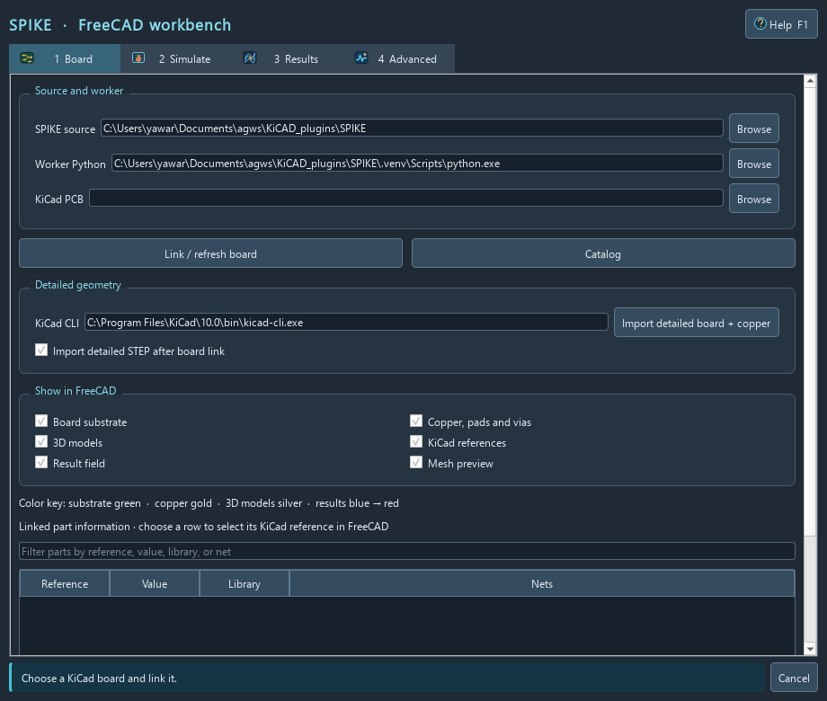
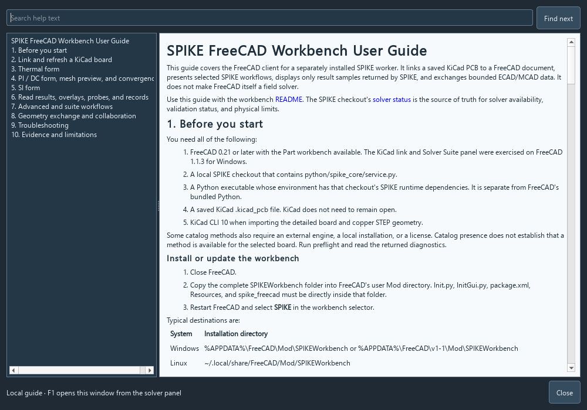

# SPIKE FreeCAD Workbench User Guide

This guide covers the FreeCAD client for a separately installed SPIKE worker.
It links a saved KiCad PCB to a FreeCAD document, presents selected SPIKE
workflows, displays only result samples returned by SPIKE, and exchanges
bounded ECAD/MCAD data. It does not make FreeCAD itself a field solver.

Use this guide with the workbench [README](../README.md). The separate SPIKE
worker checkout's `docs/SOLVER_STATUS.md` is the source of truth for solver
availability, validation status, and physical limits.

## 1. Before you start

You need all of the following:

1. FreeCAD 0.21 or later with the Part workbench available. The KiCad link and
   Solver Suite panel were exercised on FreeCAD 1.1.3 for Windows.
2. A local SPIKE checkout that contains `python/spike_core/service.py`.
3. A Python executable whose environment has that checkout's SPIKE runtime
   dependencies. It is separate from FreeCAD's bundled Python.
4. A saved KiCad `.kicad_pcb` file. KiCad does not need to remain open.
5. KiCad CLI 10 when importing the detailed board and copper STEP geometry.

Some catalog methods also require an external engine, a local installation, or
a license. Catalog presence does not establish that a method is available for
the selected board. Run preflight and read the returned diagnostics.

### Install or update the workbench

1. Close FreeCAD.
2. Copy the complete `SPIKEWorkbench` folder into FreeCAD's user `Mod`
   directory. `Init.py`, `InitGui.py`, `package.xml`, `Resources`, and
   `spike_freecad` must be directly inside that folder.
3. Restart FreeCAD and select **SPIKE** in the workbench selector.

Typical destinations are:

| System | Installation directory |
| --- | --- |
| Windows | `%APPDATA%\FreeCAD\Mod\SPIKEWorkbench` or `%APPDATA%\FreeCAD\v1-1\Mod\SPIKEWorkbench` |
| Linux | `~/.local/share/FreeCAD/Mod/SPIKEWorkbench` |
| macOS | `~/Library/Application Support/FreeCAD/Mod/SPIKEWorkbench` |

In FreeCAD's Python console, `App.getUserAppDataDir()` reports the user data
directory to which `Mod/SPIKEWorkbench` is appended. To update, replace only
the installed `SPIKEWorkbench` folder while FreeCAD is closed. To remove it,
remove that same folder.

### Confirm the worker first

Set up the environment using the SPIKE checkout's `DEVELOPMENT.md` and pinned
requirements. A source development environment on Windows can start with:

```powershell
cd 'C:\path\to\SPIKE'
py -3.12 -m venv .venv
.\.venv\Scripts\python.exe -m pip install -r requirements.txt
'{"id":"health","method":"health","params":{}}' |
  .\.venv\Scripts\python.exe -m python.spike_core.service
```

A healthy worker replies with `ok: true`. Choose the Python version and
dependency set supported by that checkout. This only prepares the local SPIKE
worker; it does not install optional engines.

## 2. Link and refresh a KiCad board

Open **SPIKE > SPIKE Solver Suite** and supply:

| Field | What to enter |
| --- | --- |
| **SPIKE source** | Checkout directory that contains `python/spike_core/service.py` |
| **Worker Python** | The Python executable in the SPIKE environment |
| **KiCad PCB** | The saved `.kicad_pcb` file |
| **KiCad CLI** | Optional explicit `kicad-cli` location when automatic detection fails |

Click **Link / refresh board**. The panel imports the board design data used by
the worker and fills the part table with reference, value, library, and net
information. It retains the source path, source SHA-256 digest, design ID, and
part count in the FreeCAD document. Save the document as an `.FCStd` file after
linking.

The default **Import detailed STEP after board link** setting asks KiCad CLI to
import a STEP representation of the board, copper, holes, and available 3D
component models. You can also use **Import detailed board + copper** later.
This STEP geometry is visual context; SPIKE analyses use the imported DesignIR
data, not a mesh reconstructed from the STEP file.


*Copper detail from a KiCad STEP export. It is presentation geometry, not a
solver mesh.*

### Refresh rules

The panel watches the board source and an attached analysis checks its digest.
After changing the PCB in KiCad, save it and use **Link / refresh board**
before running another workflow. A stale design is intentionally rejected.
Reopen an existing `.FCStd`, open Solver Suite, and refresh to load the current
board into the worker; the saved source path prepopulates the board field.

FreeCAD uses the KiCad STEP frame where positive KiCad Y maps to negative Y.
Enter XY probe locations in KiCad coordinates. Review an `.FCStd` before
sharing: it can retain local source paths and part metadata.

### Control geometry visibility and colors

The **Board** page checkboxes independently show or hide:

- **Board substrate** (green)
- **Copper, pads and vias** (gold, when the STEP substrate can be separated)
- **3D models**
- **KiCad references**
- **Result field**
- **Mesh preview**

Available 3D models are silver. The result field uses a blue-to-red scale with
its actual minimum, maximum, unit, and model status on the **Results** page.
The substrate/copper split uses a dominant substrate solid in the KiCad STEP.
When that distinction is not supported by the imported shape, the original
compound remains a single approximate geometry feature. The visual colors
do not classify electrical connectivity or material properties for a solver.

The panel has four pages: **Board**, **Simulate**, **Results**, and
**Advanced**. Filter linked parts by reference, value, library, or net; select
a row to highlight that reference in the FreeCAD tree. Press **F1** or the
toolbar **Help** icon for this searchable guide.



*FreeCAD 1.1 Qt render of the Board page before a board is linked.*



*The F1 help window reads this guide from the installed workbench.*

Missing footprint models remain absent. KiCad can record a warning on the
imported component object; resolve the footprint's 3D model path in KiCad and
refresh. Reference markers and wires are reference geometry, not solid package
models.


*Only models available to KiCad are imported. Unresolved models are not
invented by the workbench.*

## 3. Thermal form

Open the **Thermal** tab after linking the board. Enter ambient temperature,
effective board conductivity, thickness, top and bottom convection, grid step,
and the explicit contact/resistance values. Add a positive loss in watts beside
each component that should contribute heat; a blank power cell excludes that
part.

Choose **Couple powered parts through imported copper pad lands** only when the
selected part has admitted copper pads and you want the worker's pad contact
distribution. With it clear, the form uses the entered square contact size.
Then use **Preview thermal grid in FreeCAD** to inspect the exact rectangular
grid, or **Run board thermal** to run the worker request.

The form does not infer conductivity, airflow, loss, contact size, or thermal
resistance from KiCad. The board thermal result is `approximate`. The current
model is an experimental bounding-rectangle model with prescribed effective
properties; it does not establish a conforming-outline, enclosure, airflow,
package, solder, die, or measured-board thermal result. Read the SPIKE
[thermal guide](../../../../docs/THERMAL_USER_GUIDE.md) and solver status before
engineering use.


*The illustrated result is a local demo with 3,024 returned samples and an
`approximate` model status. The overlay projects those samples; it is not board
qualification.*

## 4. PI / DC form, mesh preview, and convergence

On **PI / DC**, choose one copper net, then choose distinct source and load
pads on that net. Enter source voltage, load current, zone cell size, and the
maximum number of preview cells.

1. Use **Preflight PI/DC** to validate the request and show the generated
   analysis specification. A preflight pass does not guarantee a successful
   solve.
2. Use **Preview actual PI mesh in FreeCAD** to see selected-net tracks, zones,
   pads, and vias returned by the worker. The preview limit is 1 through 5,000
   cells and can truncate displayed geometry.
3. Use **Run PI/DC copper analysis** only after reviewing preflight issues.
4. Use **Run 3-level PI mesh convergence** for the 2x, 1x, and 0.5x requested
   cell sizes. Inspect the returned comparison and `passed` or
   `failed_to_converge` status.

The preview reports cell count, truncation, and maximum aspect ratio. It has no
inferred voltage, electric field, or magnetic field values. A refined-looking
preview or a preflight pass is not convergence evidence. The available routed
DC solver is a sparse resistive network with finite-volume zone spreading;
zone sign-off requires a mesh-convergence comparison.


*A sampled selected-net preview. Its reported aspect ratio and truncation must
be considered with the convergence report; the image is not a solved field.*

## 5. SI form

The first SI workflow accepts an explicit, uniform RLGC channel. Enter every
channel, source, receiver, and bit-rate value yourself, then use **Run SI
channel workflow**. Values in this form are not extracted from the visible PCB
copper.

The linked-board path is narrower. Choose distinct signal and reference nets,
a reference copper layer, and a path mode, then use **Run linked board SI
extraction**. It reimports canonical DesignIR v2 and rejects a changed source
or a board outside its bounded geometry/material envelope. `strict_uniform`
requires the supported uniform path; `piecewise_planar` is a bounded
same-layer constant-width approximation over an explicitly covering reference
zone.

Both SI paths are experimental. The worker can return loaded transfer,
waveform, eye, TDR, impedance, and reflection data when applicable. Use **Plot
supplied traces (SI / circuit / time series)** to plot traces supplied in that
response. Network-only SI results explicitly report spatial E/H maps as
unsupported, so the workbench cannot create a 3D E/H overlay for them. General
geometry-derived S-parameters, vias and antipads, bends and launches,
connectors, arbitrary coupled lines, production SI validation, and VNA/TDR
correlation remain outside this workflow's validated scope.

## 6. Read results, overlays, probes, and records

The response pane preserves the worker's `status`, `model_status`, assumptions,
diagnostics, provenance, and supported field data. It displays at most 100,000
characters. Save a full returned record with **Save response JSON** and
restore one with **Load response JSON**. Responses above 64 MiB need a
bounded request or SPIKE's CLI artifact workflow.

### Spatial result fields

If the returned result contains a supported spatial field for the current
linked design and source digest:

1. Select the field in the result field list.
2. Click **Show field**.
3. Toggle **Result field** to hide or show the overlay without clearing it.
4. Click **Clear field** to remove the displayed overlay.

The workbench only projects finite spatial samples that the solver returned. A
completed network-only result, a blocked result, a mismatched design/digest, or
a result with no spatial samples cannot become a field overlay.
The top projection is placed just above the actual imported copper surface,
with the KiCad Y direction mapped to FreeCAD's STEP frame. By default the
Results page hides 3D models while a field is shown so the board samples can
be seen; clear the field to restore them. The overlay is a display of returned
samples, not an independently solved FreeCAD field.

### Probe a returned field

Use **Probe XY** with KiCad X and Y in millimetres, or select a board/result
point in FreeCAD and use **Probe picked point**. A probe reads the nearest
returned spatial sample. It does not interpolate a new physical field.

Use **Plot supplied SI / circuit traces** for SI, circuit, and other time-series result
data. Trace probing is based on samples supplied by the worker.

### Treat status as data

| Returned state | Meaning in this client |
| --- | --- |
| `completed` | The worker completed its request. Read `model_status`, assumptions, diagnostics, and provenance before using it. |
| `approximate` | The result has a stated approximation boundary. Retain it in reports and do not promote it to validation. |
| `unsupported` | The requested capability has no admitted implementation for this request. Select a supported workflow or change the request. |
| `blocked` / failed preflight | The worker found an unmet requirement. Correct the listed diagnostics and rerun preflight. |
| `failed_to_converge` | The mesh convergence comparison did not meet its criterion. Do not treat the refined result as converged. |

## 7. Advanced and suite workflows

**Catalog** lists worker methods the configured runtime exposes. Select `auto`
or a catalog solver, supply a versioned analysis-spec JSON, then use
**Preflight** and **Run analysis**. Provide the nets, sources, loads, stackup,
materials, frequency settings, and mesh configuration required by the chosen
physics.

For a specific worker API, choose or type an **Advanced worker method**, enter
its JSON `params`, and use **Run method**. **Attach linked board** adds the
current DesignIR only when `params` does not already include `design`; clear it
for methods that do not accept a design. **Run configured suite** accepts an
array of 1 through 32 explicit method-plus-params jobs and runs them in order.
Use **Cancel** to terminate the active worker process.

Advanced methods expose an API, not a generic solver promise. Use that method's
schema, examples, catalog/preflight output, and the SPIKE solver status.

## 8. Geometry exchange and collaboration

The SPIKE menu and toolbars provide these bounded integration commands:

| Command | Use |
| --- | --- |
| **Import SPIKE Geometry** | Import validated `spike/ecad-mcad-geometry/v1` JSON primitives: `box`, `cylinder`, and one-outer-loop `polygon_prism`. |
| **Export SPIKE Envelopes/Keepouts** | Export selected solids or objects tagged `SPIKEExport = true` as global axis-aligned bounding boxes in `spike/ecad-mcad-mechanical/v1`. |
| **Export SPIKE Assembly** | Export selected roots or parts with STEP-backed local geometry, hierarchy, names, and rigid placements as `.spikeassembly`. |
| **Open SPIKE Collaboration Session** | Open an SPIKE-generated session, edit retained occurrence placements or labels, and prepare feedback. |
| **Send Placement Feedback to SPIKE** | Send a reviewable placement proposal for SPIKE to review and apply. |
| **Measure SPIKE Solid Clearance** | With two solid occurrences selected, measure minimum separation and overlap volume. |

FreeCAD edits do not silently rewrite the KiCad PCB. Placement changes also
invalidate prior measurements. Exchange uses millimetres and right-handed Z-up
coordinates, preserves IDs/roles/metadata/digests, and has bounded strict
validation. It is neither a physical simulation nor a manufacturing
qualification.

## 9. Troubleshooting

| Symptom | Recovery |
| --- | --- |
| SPIKE is missing from the workbench selector | Check that `Mod/SPIKEWorkbench/InitGui.py` is at that exact depth, restart FreeCAD, and use `App.getUserAppDataDir()` to confirm the installation root. |
| Link fails or the worker exits | Confirm the SPIKE source contains `python/spike_core/service.py`, Worker Python is a valid executable, and that environment passes the checkout health check. |
| The board changed on disk | Save in KiCad, then choose **Link / refresh board**. Attached analysis runs intentionally reject stale digests. |
| Detailed geometry is missing | Set KiCad CLI explicitly if detection failed. Resolve KiCad footprint 3D model paths for package models, then refresh. |
| A selected linked part has no solid clearance | A missing package is represented only by a marker; import/resolution of a STEP-backed model is required for solid clearance. |
| Thermal colors appear displaced or float over components | Refresh the link with workbench 0.5.0 or later. KiCad probe XY stays in KiCad coordinates while the STEP frame reverses Y; the overlay height follows the copper top surface. |
| PI preview is truncated or too coarse | Lower the zone cell size, adjust the 1-5,000 preview limit, review quality metrics, and run convergence. The display cap does not change the solver mesh. |
| A field cannot be shown or probed | Run an analysis for the current linked board. Confirm its result contains spatial samples, is not blocked, and its design ID and source digest match the link. |
| An SI field overlay is expected | Uniform/channel network results provide traces and port data, not spatial E/H samples; use supplied trace plots. |
| A method reports unsupported or blocked | Read Catalog and the worker diagnostic. Check its schema, external-engine needs, and the solver status before changing parameters. |
| KiCad did not receive a FreeCAD change | Send placement feedback to SPIKE and review/apply it there. The workbench never writes PCB geometry directly. |

## 10. Evidence and limitations

The workbench's FreeCAD kernel smoke test covers local geometry and exchange;
it is not solver validation. The images in this guide are local FreeCAD 1.1.3
captures and result projections from the demo board. Their source and
redistribution notes are in [asset provenance](ASSET_PROVENANCE.md).

For release or engineering decisions, retain the input board digest, request,
worker response, solver status, approximation/unsupported states, mesh
convergence result when applicable, and the assumptions used by the selected
method. Numerical work requires the validation evidence and knowledgeable human
review required by the SPIKE project.
